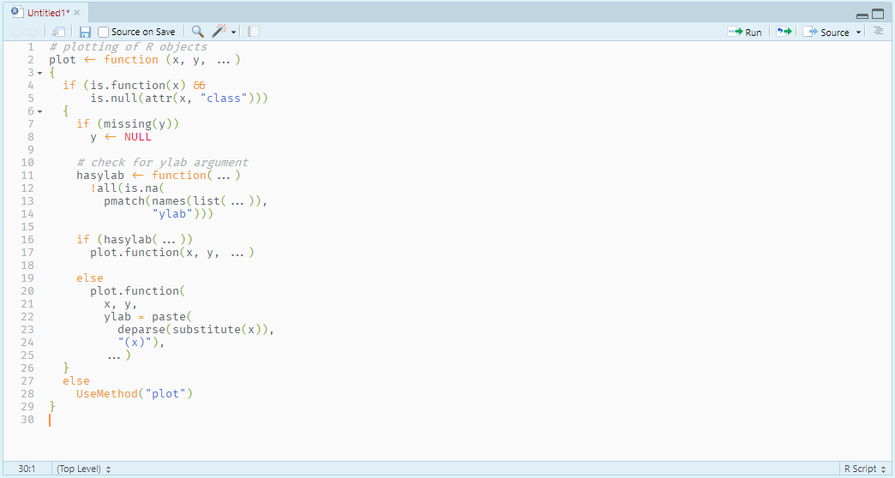
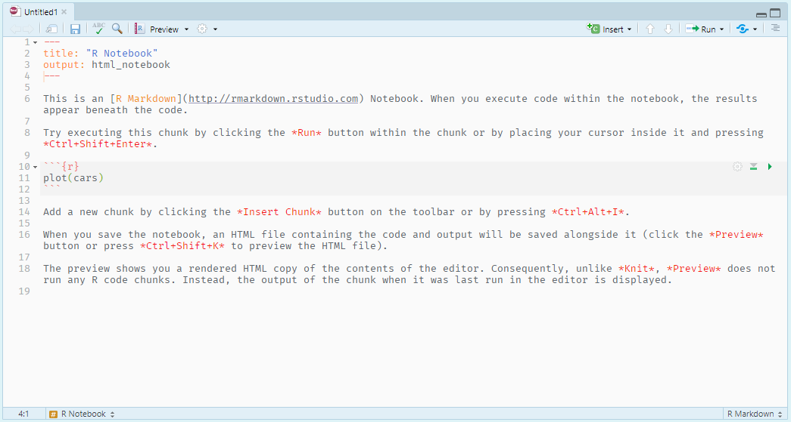

# Ayu-Light-Owl
A light theme for RStudio adapted from [Ayu Light](https://github.com/dempfi/ayu) and [Light Owl](https://github.com/sdras/night-owl-vscode-theme) themes

* [Ayu Light theme v4.0.3](https://github.com/dempfi/ayu/releases/tag/4.0.3) (the latest version of Ayu theme available for `.tmTheme` format) is modified by the color scheme of [Light Owl](https://github.com/sdras/night-owl-vscode-theme) theme.


## Syntax highlighting examples 
(Font in the screentshots: [Fira Code](https://github.com/tonsky/FiraCode))

### In R Script



### In R Notebook



## Installation
* Prerequisite: RStudio v1.2.0 or higher
* Download [`.rstheme`](/ayu-light-owl.rstheme) file in this repo.
* Follow the instruction in the **Importing a Custom Theme** section in [this page](https://blog.rstudio.com/2018/10/29/rstudio-ide-custom-theme-support/).

```R
# works in R 4.2.1 and RStudio 2022.07.1
if (!requireNamespace("rstudioapi", quietly = TRUE)) install.packages("rstudioapi")
library(rstudioapi)
ahjota_light_owl <- "https://raw.githubusercontent.com/ahjota/ayu-light-owl/master/ayu-light-owl.rstheme"
rstudioapi::addTheme(ahjota_light_owl, apply = TRUE)
```

## Any suggestions?
This project is developed for my personal need and I am not well versed in working with `.rstheme`. If you have any suggestions or experience any troubles, please feel free to [file an issue](https://github.com/js-oh/ayu-light-owl/issues).
